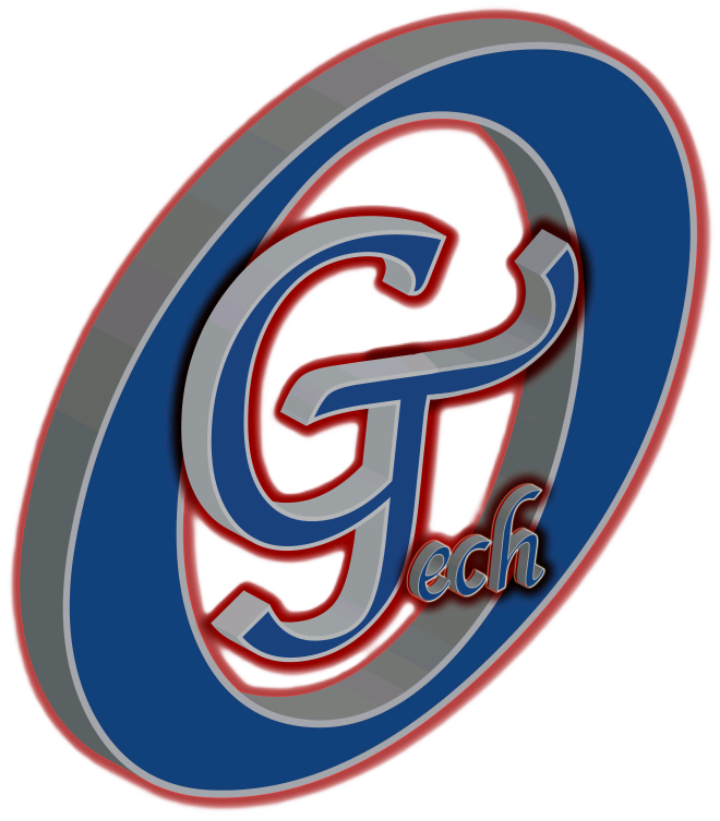

<div align="center">
  
  <h1>G-TECH ALUMINUM & PVC PRODUCTION PLC</h1>
  <p><strong>Leading Ethiopian Industry Experience in Architectural Building Envelopes</strong></p>

  [](https://vitejs.dev/)
  [](https://react.dev/)
  [](https://tailwindcss.com/)
  [](https://www.typescriptlang.org/)
</div>

---

## 🏗️ About G-TECH

G-TECH is a multi-disciplinary powerhouse based in Addis Ababa, Ethiopia, specializing in high-performance Aluminum and PVC systems. Established in 2010, we bridge the gap between architectural imagination and structural reality with precision engineering and world-class standards.

### 🌟 Core Solutions
- **Aluminum Systems**: World-class profile systems for windows and doors (Partner: LORENZOLINE).
- **Power Generation**: Industrial diesel solutions and portable units (Partner: GUCBIR).
- **Elevator Systems**: Advanced vertical transportation with MRL technology (Partner: KERNEK ASANSOR).

---

## ✨ Features

- **Modern Architecture**: Immersive UI built with React 19 and Framer Motion for smooth transitions.
- **Responsive Design**: Fully optimized for mobile, tablet, and desktop using Tailwind CSS.
- **Dynamic Catalog**: Interactive product showcasing with detailed specifications.
- **Project Portfolio**: Displaying iconic projects across Ethiopia like the Bole Tower Complex.
- **Performance Optimized**: Built with Vite for lightning-fast development and production builds.

---

## 🛠️ Technology Stack

| Category | Technology |
| :--- | :--- |
| **Frontend** | React 19, TypeScript, Tailwind CSS |
| **Animations** | Motion (Framer Motion) |
| **Icons** | Lucide React |
| **Routing** | React Router 7 |
| **State Management** | Zustand |
| **Build Tool** | Vite |

---

## 🚀 Getting Started

### Prerequisites
- [Node.js](https://nodejs.org/) (Latest LTS recommended)
- [npm](https://www.npmjs.com/)

### Installation

1. **Clone the repository**
   ```bash
   git clone https://github.com/israelseleshi/g-tech-aluminum-and-pvc.git
   ```

2. **Install dependencies**
   ```bash
   npm install --legacy-peer-deps
   ```
   *Note: `--legacy-peer-deps` is required for React 19 compatibility with certain packages.*

3. **Environment Setup**
   Create a `.env` file in the root directory:
   ```env
   GEMINI_API_KEY=your_api_key_here
   ```

4. **Run Development Server**
   ```bash
   npm run dev
   ```
   Visit `http://localhost:3000` in your browser.

---

## 📂 Project Structure

- `src/components`: Reusable UI components.
- `src/pages`: Application views (Home, Solutions, About, etc.).
- `src/layouts`: Main application shell and navigation.
- `src/data`: Static product and project data.
- `public/`: Assets including logos and product images.

---

## 🤝 Partnership

Developed by **Nano Computing ICT Solutions**.
- [Website](https://nanocomputingict.com/)
- *Your Integrated Safety Partner*

---

<div align="center">
  <p>© 2026 G-TECH ALUMINUM & PVC PRODUCTION PLC. All Rights Reserved.</p>
</div>
